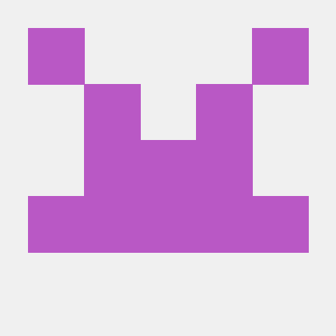
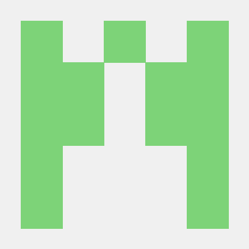
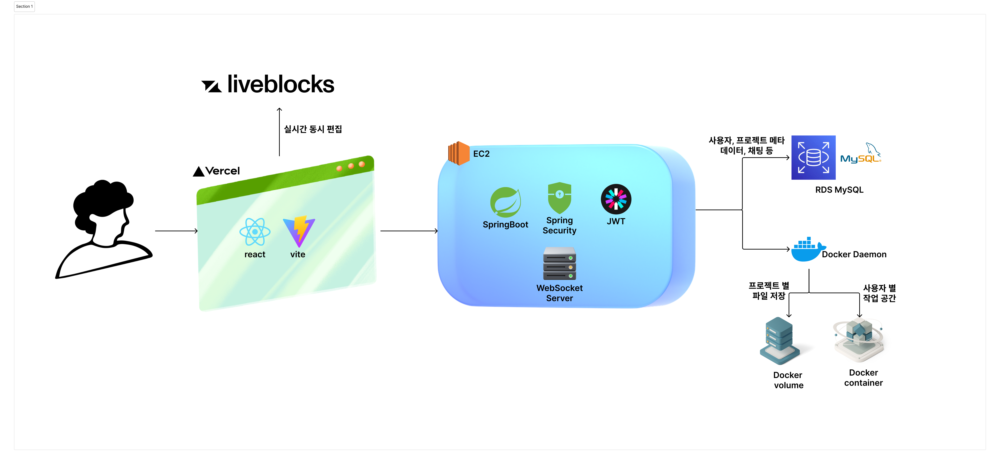

# web-ide-be
> 구름톤 딥다이브 풀스택 13회차 백엔드 GrowLog🌱  
> 개발 기간: 2025.07.11 - 2025.08.03

> FE Github  
> [web-ide-fe](https://github.com/GROWLOG-youtube-mockup/web-ide-fe)

# 팀원 소개

 profile  |                                                                                    |                                                                              |                                                                        |
-----|-------------------------------------------------------------------------------------------------------------------------------|---------------------------------------------------------------------------------------------------------------------|-------------------------------------------------------------------------------------------------------------------|---
 name| 
강현아 
                                                                                                    | 
김유진
                                                                                           | 
이혜원
                                                                                         |
최지유

Github| 

 | 

 | 

 | 

 |
Project Role| 
프로젝트&파일 시스템/터미널 실행 구현, 프로젝트 초기 세팅
                                                                   | 
파일 탐색기 구현,  AWS 세팅
                                                                         | 
사용자 인증/코드 편집기 구현,  CI/CD 세팅
                                                              | 
채팅 구현,  Docker 개발 환경 세팅

# 프로젝트 소개

## 배포주소

## 기술 스택
| Category       | Stack                                                                                             |
|----------------|---------------------------------------------------------------------------------------------------|
| Language       |                                     |
| Framework      |        |
| Real-time Comm |                |
| Database       |     |
| Auth           |      |
| Infra & Deploy |           |

## 아키텍쳐

## workflow

## 주요 기능

## 시연 영상
